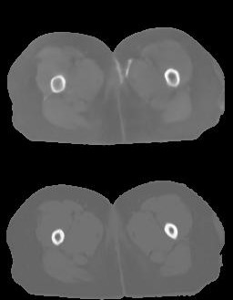

# Unet
Unet model for medical image segmentation and synthesis. Specificly, generating CT images from MR images.

Some of the codes are from https://github.com/toimcio .

A typical result would be:

Where the top one is the output and the bottom is the target.

